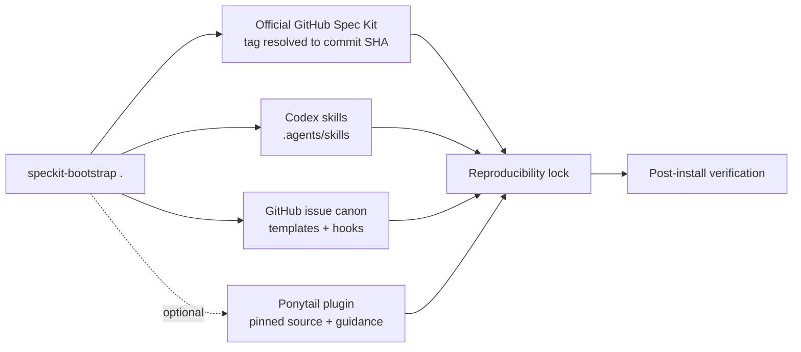

<h1 align="center">speckit-bootstrap</h1>

<p align="center">
  <strong>Reproducible Spec-Driven Development for Codex — in one command.</strong>
</p>

<p align="center">
  Turn any Git repository into a tested GitHub Spec Kit + Codex workspace
  with pinned inputs, reusable skills, GitHub issue automation, and a lockfile
  you can replay.
</p>

<p align="center">
  <strong>Language:</strong>
  <a href="README.md">English</a> · <a href="README.ru.md">Русский</a>
</p>

<p align="center">
  <a href="https://github.com/yshishenya/speckit-bootstrap/actions/workflows/ci.yml"></a>
  <a href="https://github.com/yshishenya/speckit-bootstrap/releases/latest"></a>
  <a href="LICENSE"></a>
  
  
</p>

> [!NOTE]
> `speckit-bootstrap` is a community project. It builds on the official
> [GitHub Spec Kit](https://github.com/github/spec-kit), but it isn't affiliated
> with or endorsed by GitHub.

## Why speckit-bootstrap?

Spec-Driven Development is powerful. Keeping its CLI, workflows, extensions,
agent skills, project policy, and tracker integration aligned by hand isn't.

`speckit-bootstrap` turns that moving toolchain into one idempotent command:

```sh
speckit-bootstrap .
```

| Without bootstrap | With `speckit-bootstrap` |
| --- | --- |
| Install and wire every component manually | One command installs or refreshes the complete stack |
| “Latest” changes underneath you | Every resolved tag, commit, source, and payload digest is locked |
| Drift appears during implementation | `--doctor` detects drift before work starts |
| Upgrades leave noisy or partial state | Refresh-only noise is hidden and incomplete state fails verification |
| Agent and GitHub conventions vary by project | Reusable Codex skills and issue canon are installed consistently |
| Rollback means reconstructing an old setup | `--frozen` replays and verifies the recorded dependency set |

## Quick start

You need macOS or Ubuntu with `git`, `curl`, `python3`, and
[`uv`](https://docs.astral.sh/uv/). The `codex` CLI is needed only for the
optional Ponytail setup.

### 1. Install or update

```sh
curl -fsSL https://raw.githubusercontent.com/yshishenya/speckit-bootstrap/v0.9.0/install.sh | bash
```

The first-stage installer comes from the immutable release tag. It resolves the
latest GitHub Release, downloads the executable and its SHA-256 file, verifies
the checksum and shell syntax, and installs it atomically at:

```text
~/.local/bin/speckit-bootstrap
```

Make sure `~/.local/bin` is on your `PATH`, then verify the installation:

```sh
export PATH="$HOME/.local/bin:$PATH"
speckit-bootstrap --version
```

Re-run the installer at any time to update. To install a specific release:

```sh
curl -fsSL https://raw.githubusercontent.com/yshishenya/speckit-bootstrap/v0.9.0/install.sh |
  SPECKIT_BOOTSTRAP_VERSION=v0.9.0 bash
```

> [!TIP]
> Prefer to inspect scripts before running them? Download
> [`install.sh`](install.sh), review it locally, and run it with `bash`.

### 2. Bootstrap a project

For a new repository:

```sh
mkdir my-project
cd my-project
git init
speckit-bootstrap .
```

For an existing repository:

```sh
cd /path/to/project
speckit-bootstrap .
```

The first successful run creates or refreshes:

```text
.specify/
.specify/speckit-bootstrap.lock.json
.agents/skills/speckit-*/
AGENTS.md
docs/agent-guidance/
.github/ISSUE_TEMPLATE/
.github/pull_request_template.md
```

Review the diff before committing the generated project baseline.

### 3. Verify the result

```sh
speckit-bootstrap . --doctor
```

`--doctor` is read-only. It checks the installed CLI source, locked workflow,
extension payloads, optional Ponytail state, project guidance, and every
project-local skill digest. A healthy installation reports
`speckit-bootstrap: doctor OK`.

## What you get

- **Official Spec Kit, pinned.** The latest official `v*` tag is resolved to
  its immutable commit SHA before installation.
- **Fast repeat refreshes.** An installed CLI with the exact requested version
  and source commit is reused without a forced reinstall.
- **Codex-native workflows.** Generated `speckit-*` skills stay in the
  repository's `.agents/skills`, so each project uses its own locked version.
- **Governed generated workflows.** Bootstrap applies fail-closed guards for
  clarification, checklist/analyze gates, safe feature paths, canonical issue
  sync, validation handoff, and reviewed Git initialization.
- **Reproducible refreshes.** The lock records versions, commit refs, source
  URLs, workflow hashes, extension trees, and managed skill digests.
- **Safe GitHub tracking.** The bundled
  [`github-issue-canon`](https://github.com/yshishenya/spec-kit-ext-github-issue-canon)
  installs structured issue forms, a pull request template, validation hooks,
  and closeout rules.
- **Optional Ponytail integration.** With `--with-ponytail`, Codex owns the
  [`Ponytail`](https://github.com/DietrichGebert/ponytail) plugin lifecycle while
  bootstrap pins its source and keeps project guidance current.
- **Respect for user-owned state.** Existing catalogs, unrelated skills,
  guidance, and GitHub templates are preserved.
- **Fail-closed validation.** Version drift, checksum drift, missing managed
  files, and tampered executable agent inputs stop the run.
- **Clean Git diffs.** Refresh-only Spec Kit install metadata is hidden from
  normal diffs while behavioral project changes stay visible.

## How it works



The bootstrap never changes upstream repositories. It applies explicit,
reviewable managed sections to generated project files and keeps executable
skills versioned with the project that uses them.

### Latest first, locked afterward

The default non-frozen run intentionally starts from current stable releases:

1. Resolve the latest approved release tags.
2. Resolve each tag to an immutable commit.
3. Install and validate the immutable workflow, extensions, project skills,
   and the optional plugin.
4. Record exact sources and payload digests in
   `.specify/speckit-bootstrap.lock.json`.
5. Verify the completed installation before reporting success.

Later, replay that contract without resolving new versions:

```sh
speckit-bootstrap . --frozen
```

Frozen mode preserves the lock and fails if locked executable inputs have
drifted.

Locks created by v0.7 use schema v2. Run v0.9 once without `--frozen` to
regenerate them as schema v3 before using frozen mode again. That migration
preserves all user-level `speckit-*` copies and warns when manual duplicate
cleanup may be useful; project files never authorize deletion from your home
directory.

## Daily workflow

Use the fast path when you start work or want to refresh integrations:

```sh
# Preview versions and planned mutations.
speckit-bootstrap . --dry-run --json

# Apply the refresh.
speckit-bootstrap .

# Verify the result without writing.
speckit-bootstrap . --doctor
```

Then use the normal Spec Kit skills in Codex:

```text
$speckit-specify
$speckit-clarify
$speckit-plan
$speckit-checklist
$speckit-tasks
$speckit-analyze
$speckit-taskstoissues
$speckit-implement
$speckit-converge
```

`$speckit-clarify`, `$speckit-checklist`, and `$speckit-analyze` are quality
gates you can apply according to risk. Use `$speckit-taskstoissues` for tracked
feature work with a GitHub remote; skip it for read-only, documentation-only,
or tiny direct changes.

For significant or high-risk work, run `$speckit-converge` after implementation.
If it appends tasks, run `$speckit-implement` and `$speckit-converge` again
before opening the pull request. Skip convergence for read-only,
documentation-only, or tiny direct changes.

When task-to-issue synchronization runs, the installed extension automatically:

- ensures the repository's issue canon files and labels before sync;
- validates open Spec Kit issues after sync;
- keeps `tasks.md` as the implementation source of truth;
- links implementation, pull request, validation, and closeout evidence.

> [!IMPORTANT]
> The bundled GitHub issue and pull request governance is Russian-first by
> default. This is an intentional project convention and is documented in the
> generated agent guidance.

## Opinionated defaults

This project is deliberately more than a package installer. It installs a
reviewable development policy intended to keep agents, repository artifacts,
and external tracking aligned:

- Git auto-commit is enabled after completed documentation stages:
  `constitution`, `specify`, `clarify`, `plan`, `checklist`, `tasks`, and
  `analyze`.
- Every `before_*` hook, `after_implement`, and `after_taskstoissues` stays
  disabled. Implementation code and external tracker changes remain explicit.
- `tasks.md` is the implementation source of truth. GitHub Issues are the
  external execution, review, and closeout tracker.
- Tracked issue titles follow
  `[<feature>][<priority>][<area>] T###: <Russian outcome>`.
- Generated plan and task templates require an explicit risk and validation
  lane before implementation.
- Product applications and deployed services use CalVer; reusable tools and
  libraries use SemVer.
- Ponytail shapes implementation behavior but doesn't weaken the selected
  validation lane. Review installed hooks with `/hooks` after installation or
  upgrade.

Managed policy sections remain visible in the project diff. User-owned content
outside those sections is preserved.

## CLI reference

```text
speckit-bootstrap [PROJECT_DIR] [OPTIONS]
```

| Option | Effect |
| --- | --- |
| `--doctor` | Verify locked project state and optional Ponytail state without changing it |
| `--dry-run` | Resolve inputs and print the mutation plan only |
| `--version` | Print the bootstrap version and exit |
| `--frozen` | Use and verify versions from the project lock |
| `--json` | Reserve stdout for one machine-readable result |
| `--keep-local-skills` | Deprecated no-op; project-local skills are always kept |
| `--skip-cli-update` | Use the currently installed `specify` CLI |
| `--skip-ponytail` | Force Ponytail off when enabled by the environment |
| `--with-ponytail` | Install/update Ponytail plugin and project guidance |
| `-h`, `--help` | Show complete command help |

Useful recipes:

```sh
# Keep the currently installed specify-cli without resolving another version.
speckit-bootstrap . --skip-cli-update

# Pin or roll back official Spec Kit, then write a new lock.
SPEC_KIT_VERSION=vX.Y.Z speckit-bootstrap .

# Keep refresh-only install metadata visible for an audit or release.
SPECKIT_TRACK_INSTALL_METADATA=1 speckit-bootstrap .

# Explicitly enable the user-level Ponytail integration.
speckit-bootstrap . --with-ponytail
```

### Environment variables

| Variable | Purpose |
| --- | --- |
| `SPEC_KIT_VERSION` | Spec Kit tag or ref; defaults to the latest `v*` tag |
| `SPECKIT_EXTENSION_CATALOG_URL` | Override the approved extension catalog |
| `SPECKIT_GITHUB_ISSUE_CANON_VERSION` | Pin the issue-canon release tag |
| `SPECKIT_GITHUB_ISSUE_CANON_URL` | Use an explicitly reviewed custom ZIP |
| `SPECKIT_PONYTAIL_VERSION` | Pin the Ponytail release tag |
| `SPECKIT_PONYTAIL=1` | Enable Ponytail plugin and guidance operations |
| `SPECKIT_TRACK_INSTALL_METADATA=1` | Expose refresh-only metadata in Git diffs |
| `SPECKIT_BOOTSTRAP_INSTALL_DIR` | Installer target; defaults to `~/.local/bin` |
| `SPECKIT_BOOTSTRAP_VERSION` | Bootstrap release tag; defaults to `latest` |
| `SPECKIT_BOOTSTRAP_URL` | Use a custom installer payload source |
| `SPECKIT_BOOTSTRAP_SHA256` | Required checksum for a custom payload source |
| `SPECKIT_BOOTSTRAP_ALLOW_UNVERIFIED=1` | Emergency opt-in for a reviewed unverified source |

Run `speckit-bootstrap --help` for the authoritative interface.

## Prerequisites and compatibility

Required:

- `git`
- `curl`
- `python3`
- [`uv`](https://docs.astral.sh/uv/)

The `codex` CLI is required only when Ponytail is explicitly enabled.

The maintained compatibility matrix is:

- macOS with the system Bash 3.2;
- Ubuntu with Bash 5.

Other Unix-like environments may work but aren't part of the current CI gate.

## Verification and trust model

The project treats generated agent instructions as executable supply-chain
inputs, not harmless documentation.

- Release installation verifies the executable against its published SHA-256.
- The documented first-stage installer is pinned to the immutable release tag.
- External release tags are resolved to immutable commits.
- The issue-canon release asset is verified against the catalog checksum.
- Ponytail's managed marketplace descriptor pins its plugin source to a commit.
- Lock schema v3 captures complete extension and project-skill trees plus the
  immutable workflow source URL.
- Managed project paths reject symlinks, and doctor rejects unrecorded
  `speckit-*` executable skills.
- GitHub Actions are pinned by full commit SHA and audited with `zizmor`.
- CI tests Bash syntax, ShellCheck, isolated units, workflow security, and live
  bootstrap behavior on macOS and Ubuntu.

See [SECURITY.md](SECURITY.md) for private vulnerability reporting and complete
trust boundaries.

## Development

Run the fast local gate:

```sh
bash tests/ci-local.sh
```

Run the pinned end-to-end bootstrap smoke test:

```sh
SPEC_KIT_VERSION=v1.0.1 \
  SPECKIT_GITHUB_ISSUE_CANON_VERSION=v0.3.2 \
  bash tests/smoke-live.sh
```

GitHub runs the full functional gate once on each pull request, across macOS
and Ubuntu. Merging unchanged code doesn't repeat the same CI. Tag-driven
releases package the exact tested commit without rerunning functional CI, while
a separate weekly canary detects new upstream incompatibilities.

Read [CONTRIBUTING.md](CONTRIBUTING.md) before opening a pull request and check
[CHANGELOG.md](CHANGELOG.md) for release history.

## Help the project grow

If `speckit-bootstrap` saves you setup time:

- [star the repository](https://github.com/yshishenya/speckit-bootstrap)
  so other Spec Kit and Codex users can find it;
- share the quick-start link with teams adopting Spec-Driven Development;
- [open an issue](https://github.com/yshishenya/speckit-bootstrap/issues/new)
  with a reproducible bug or a concrete workflow improvement;
- contribute a focused pull request with validation evidence.

The most useful contribution is a real project story: what you bootstrapped,
what manual work disappeared, and where the workflow still got in your way.

## License

Released under the [MIT License](LICENSE).
