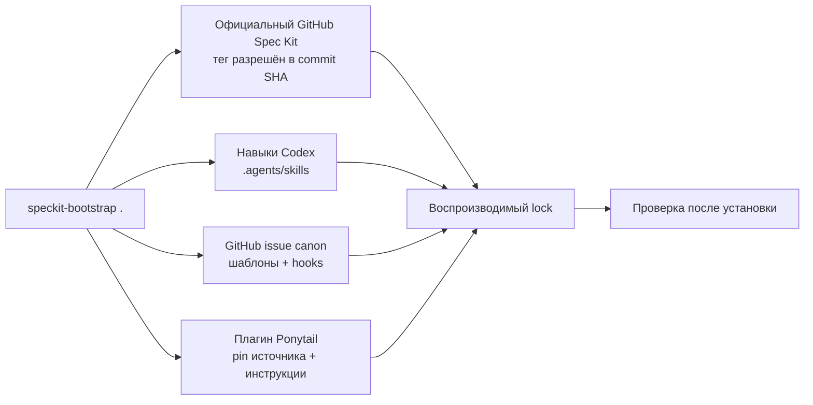

<h1 align="center">speckit-bootstrap</h1>

<p align="center">
  <strong>Воспроизводимая Spec-Driven Development для Codex — одной командой.</strong>
</p>

<p align="center">
  Превратите любой Git-репозиторий в проверенное рабочее окружение
  GitHub Spec Kit + Codex с закреплёнными зависимостями, переиспользуемыми
  навыками, автоматизацией GitHub Issues и воспроизводимым lock-файлом.
</p>

<p align="center">
  <strong>Язык:</strong>
  <a href="README.md">English</a> · <a href="README.ru.md">Русский</a>
</p>

<p align="center">
  <a href="https://github.com/yshishenya/speckit-bootstrap/actions/workflows/ci.yml"></a>
  <a href="https://github.com/yshishenya/speckit-bootstrap/releases/latest"></a>
  <a href="LICENSE"></a>
  
  
</p>

> [!NOTE]
> `speckit-bootstrap` — независимый проект сообщества. Он использует
> официальный [GitHub Spec Kit](https://github.com/github/spec-kit), но не
> является продуктом GitHub и не аффилирован с GitHub.

## Зачем нужен speckit-bootstrap?

Spec-Driven Development помогает управлять разработкой. Но вручную согласовать
CLI, workflow, расширения, навыки агента, правила проекта и GitHub-трекер сложно.

`speckit-bootstrap` превращает этот подвижный набор инструментов в одну
идемпотентную команду:

```sh
speckit-bootstrap .
```

| Без bootstrap | Со `speckit-bootstrap` |
| --- | --- |
| Каждый компонент устанавливается и связывается вручную | Одна команда устанавливает или обновляет весь набор |
| «Последняя версия» незаметно меняется | Каждый тег, commit, источник и digest записывается в lock |
| Drift обнаруживается во время реализации | `--doctor` находит расхождения до начала работы |
| Обновление оставляет шумный или частичный результат | Служебный шум скрывается, а неполное состояние не проходит проверку |
| Правила агентов и GitHub различаются между проектами | Навыки Codex и issue canon устанавливаются одинаково |
| Для отката приходится восстанавливать окружение вручную | `--frozen` повторяет и проверяет зафиксированный набор |

## Быстрый старт

Нужны macOS или Ubuntu с `git`, `curl`, `python3` и
[`uv`](https://docs.astral.sh/uv/). `codex` CLI требуется, если Ponytail
явно не отключён.

### 1. Установите или обновите

```sh
curl -fsSL https://raw.githubusercontent.com/yshishenya/speckit-bootstrap/v0.9.9/install.sh | bash
```

Первый установщик загружается из immutable release tag. Он определяет последний
GitHub Release, скачивает исполняемый файл и его SHA-256, проверяет checksum и
синтаксис shell, а затем атомарно устанавливает команду в:

```text
~/.local/bin/speckit-bootstrap
```

Убедитесь, что `~/.local/bin` находится в `PATH`, и проверьте установку:

```sh
export PATH="$HOME/.local/bin:$PATH"
speckit-bootstrap --version
```

Повторный запуск установщика обновляет bootstrap. Для конкретной версии:

```sh
curl -fsSL https://raw.githubusercontent.com/yshishenya/speckit-bootstrap/v0.9.9/install.sh |
  SPECKIT_BOOTSTRAP_VERSION=v0.9.9 bash
```

> [!TIP]
> Хотите сначала проверить скрипт? Скачайте [`install.sh`](install.sh),
> прочитайте его локально и запустите через `bash`.

### 2. Подготовьте проект

Для нового репозитория:

```sh
mkdir my-project
cd my-project
git init
speckit-bootstrap .
```

Для существующего репозитория:

```sh
cd /path/to/project
speckit-bootstrap .
```

Первый успешный запуск создаёт или обновляет:

```text
.specify/
.specify/speckit-bootstrap.lock.json
.agents/skills/speckit-*/
AGENTS.md
docs/agent-guidance/
.github/ISSUE_TEMPLATE/
.github/pull_request_template.md
```

Перед commit проверьте diff созданной конфигурации проекта.

### 3. Проверьте результат

```sh
speckit-bootstrap . --doctor
```

`--doctor` ничего не изменяет. Он проверяет источник CLI, зафиксированный
workflow, payload расширений, состояние Ponytail, инструкции
проекта и digest каждого project-local навыка. Исправная установка сообщает
`speckit-bootstrap: doctor OK`.

## Что вы получаете

- **Официальный Spec Kit с pin.** Последний официальный тег `v*` разрешается в
  неизменяемый commit SHA до установки.
- **Быстрые повторные обновления.** Установленный CLI с точным совпадением
  версии и commit источника используется без принудительной переустановки.
- **Workflow для Codex.** Сгенерированные навыки `speckit-*` остаются в
  `.agents/skills` репозитория, поэтому каждый проект использует свою
  зафиксированную версию.
- **Управляемый generated workflow.** Bootstrap добавляет fail-closed guards
  для clarify, checklist/analyze, безопасных feature paths, канонического issue
  sync, validation handoff и проверяемой инициализации Git.
- **Воспроизводимые обновления.** Lock хранит версии, commit refs, URL
  источников, hashes workflow, деревья расширений и digests навыков.
- **Безопасный GitHub-трекинг.** Встроенный
  [`github-issue-canon`](https://github.com/yshishenya/spec-kit-ext-github-issue-canon)
  добавляет формы задач, шаблон pull request, validation hooks и правила
  closeout.
- **Ponytail по умолчанию.** Bootstrap устанавливает последнюю версию плагина
  [`Ponytail`](https://github.com/DietrichGebert/ponytail) для Codex, закрепляет
  неизменяемый источник и поддерживает инструкции проекта в актуальном виде.
  Для явного отказа используйте `--skip-ponytail` или `SPECKIT_PONYTAIL=0`.
- **Сохранность пользовательского состояния.** Существующие каталоги,
  сторонние навыки, инструкции и GitHub-шаблоны сохраняются.
- **Fail-closed проверки.** Drift версий и checksum, пропавшие управляемые файлы
  и изменённые исполняемые инструкции агента останавливают процесс.
- **Чистый Git diff.** Служебные install-метаданные скрываются из обычного diff,
  а изменения поведения проекта остаются видимыми.

## Как это работает



Bootstrap никогда не изменяет upstream-репозитории. Он добавляет явные и
проверяемые управляемые секции в файлы проекта и хранит исполняемые навыки
вместе с проектом, который их использует.

### Сначала актуальное, затем зафиксированное

Обычный запуск намеренно начинает с актуальных стабильных релизов:

1. Определяет последние разрешённые release tags.
2. Разрешает каждый тег в неизменяемый commit.
3. Устанавливает и проверяет immutable workflow, расширения, project-local
   навыки и последнюю версию Ponytail.
4. Записывает точные источники и digests в
   `.specify/speckit-bootstrap.lock.json`.
5. Проверяет готовую установку перед успешным завершением.

После этого зафиксированный контракт можно повторить без поиска новых версий:

```sh
speckit-bootstrap . --frozen
```

Frozen-режим сохраняет lock неизменным и завершает работу с ошибкой, если
зафиксированные исполняемые данные отличаются.

Lock-файлы v0.7 используют schema v2. Один раз запустите v0.9 без `--frozen`,
чтобы пересоздать их в schema v3, и только затем снова включайте frozen-режим.
Миграция сохраняет все пользовательские копии `speckit-*` и предупреждает,
когда дубликаты стоит удалить вручную: проектные файлы не дают права удалять
данные из домашнего каталога.

## Ежедневный процесс

Используйте короткий цикл перед началом работы или обновлением интеграций:

```sh
# Посмотреть версии и план изменений.
speckit-bootstrap . --dry-run --json

# Применить обновление.
speckit-bootstrap .

# Проверить результат без записи.
speckit-bootstrap . --doctor
```

Затем запускайте обычные навыки Spec Kit в Codex:

```text
$speckit-specify
$speckit-clarify
$speckit-plan
$speckit-checklist
$speckit-tasks
$speckit-analyze
$speckit-taskstoissues
$speckit-implement
$speckit-converge
```

`$speckit-clarify`, `$speckit-checklist` и `$speckit-analyze` — проверки
качества, которые выбираются по уровню риска. Используйте
`$speckit-taskstoissues` для отслеживаемой feature-работы с GitHub remote; для
read-only, документационных и совсем небольших прямых изменений он не нужен.

Для значимой или high-risk работы запускайте `$speckit-converge` после
реализации. Если он добавил задачи, повторите `$speckit-implement`, затем
`$speckit-converge` перед созданием pull request. Для read-only, документации и
совсем небольших прямых изменений convergence не требуется.

При синхронизации задач установленное расширение автоматически:

- проверяет наличие issue canon и labels до синхронизации;
- валидирует открытые Spec Kit issues после синхронизации;
- сохраняет `tasks.md` источником истины для реализации;
- связывает реализацию, pull request, проверки и closeout evidence.

> [!IMPORTANT]
> Установленные правила GitHub Issues и pull requests по умолчанию используют
> русский язык. Это осознанное соглашение проекта, записанное в инструкциях
> агента.

## Принятые соглашения

Это намеренно больше, чем установщик пакетов. Bootstrap добавляет проверяемую
политику разработки, которая согласует агентов, артефакты репозитория и внешний
трекинг:

- Git auto-commit включён после завершённых документационных этапов:
  `constitution`, `specify`, `clarify`, `plan`, `checklist`, `tasks` и
  `analyze`.
- Все hooks `before_*`, а также `after_implement` и `after_taskstoissues`
  отключены. Изменения кода и внешнего трекера остаются явными.
- `tasks.md` — источник истины для реализации. GitHub Issues используются для
  исполнения, review и closeout.
- Заголовки отслеживаемых issues имеют формат
  `[<feature>][<priority>][<area>] T###: <результат на русском>`.
- Сгенерированные шаблоны plan и tasks требуют выбрать уровень риска и набор
  проверок до реализации.
- Продуктовые приложения и развёрнутые сервисы используют CalVer, а
  переиспользуемые инструменты и библиотеки — SemVer.
- Ponytail управляет формой реализации, но не ослабляет выбранные проверки.
  После установки или обновления проверьте hooks командой `/hooks`.

Управляемые секции политики остаются видимыми в diff проекта. Пользовательское
содержимое за пределами этих секций сохраняется.

## Справочник CLI

```text
speckit-bootstrap [PROJECT_DIR] [OPTIONS]
```

| Опция | Результат |
| --- | --- |
| `--doctor` | Проверить lock-состояние проекта и Ponytail без изменений |
| `--dry-run` | Определить входные версии и показать только план изменений |
| `--version` | Показать версию bootstrap и завершить работу |
| `--frozen` | Использовать и проверить версии из lock-файла проекта |
| `--json` | Оставить в stdout только один машиночитаемый результат |
| `--keep-local-skills` | Устаревшая no-op опция; локальные навыки сохраняются всегда |
| `--skip-cli-update` | Использовать уже установленный `specify` CLI |
| `--skip-ponytail` | Отключить Ponytail и обновление инструкций по умолчанию |
| `--with-ponytail` | Явно включить Ponytail (оставлено для совместимости) |
| `-h`, `--help` | Показать полную справку команды |

Полезные рецепты:

```sh
# Использовать текущий specify-cli без определения другой версии.
speckit-bootstrap . --skip-cli-update

# Закрепить или откатить Spec Kit и записать новый lock.
SPEC_KIT_VERSION=vX.Y.Z speckit-bootstrap .

# Показать служебные install-метаданные для аудита или релиза.
SPECKIT_TRACK_INSTALL_METADATA=1 speckit-bootstrap .

# Явно отключить user-level интеграцию Ponytail по умолчанию.
speckit-bootstrap . --skip-ponytail
```

### Переменные окружения

| Переменная | Назначение |
| --- | --- |
| `SPEC_KIT_VERSION` | Тег или ref Spec Kit; по умолчанию последний тег `v*` |
| `SPECKIT_EXTENSION_CATALOG_URL` | Переопределить разрешённый каталог расширений |
| `SPECKIT_GITHUB_ISSUE_CANON_VERSION` | Закрепить release tag issue-canon |
| `SPECKIT_GITHUB_ISSUE_CANON_URL` | Использовать проверенный пользовательский ZIP |
| `SPECKIT_PONYTAIL_VERSION` | Закрепить release tag Ponytail |
| `SPECKIT_PONYTAIL=0` | Отключить операции с плагином и инструкциями Ponytail по умолчанию |
| `SPECKIT_TRACK_INSTALL_METADATA=1` | Показать служебные метаданные в Git diff |
| `SPECKIT_BOOTSTRAP_INSTALL_DIR` | Путь установки; по умолчанию `~/.local/bin` |
| `SPECKIT_BOOTSTRAP_VERSION` | Release tag bootstrap; по умолчанию `latest` |
| `SPECKIT_BOOTSTRAP_URL` | Использовать собственный источник executable |
| `SPECKIT_BOOTSTRAP_SHA256` | Обязательный checksum для собственного источника |
| `SPECKIT_BOOTSTRAP_ALLOW_UNVERIFIED=1` | Аварийное разрешение проверенного источника без checksum |

Запустите `speckit-bootstrap --help`, чтобы увидеть актуальный интерфейс.

## Требования и совместимость

Необходимы:

- `git`
- `curl`
- `python3`
- [`uv`](https://docs.astral.sh/uv/)

`codex` CLI требуется только при явном включении Ponytail.

Поддерживаемая матрица:

- macOS с системным Bash 3.2;
- Ubuntu с Bash 5.

Другие Unix-подобные окружения могут работать, но пока не входят в CI gate.

## Проверки и модель доверия

Проект рассматривает сгенерированные инструкции агента как исполняемые элементы
supply chain, а не как безобидную документацию.

- При установке executable сверяется с опубликованным SHA-256.
- Первый установщик в документации закреплён на immutable release tag.
- Внешние release tags разрешаются в неизменяемые commits.
- Release asset issue-canon сверяется с checksum каталога.
- Управляемый marketplace Ponytail закрепляет источник плагина на commit.
- Lock schema v3 хранит полные деревья расширений и project-local навыков, а
  также immutable URL источника workflow.
- Управляемые пути проекта не могут быть symlink, а doctor отклоняет
  незаписанные исполняемые навыки `speckit-*`.
- GitHub Actions закреплены полными commit SHA и проверяются `zizmor`.
- CI проверяет Bash syntax, ShellCheck, изолированные unit tests, безопасность
  workflow и живой bootstrap на macOS и Ubuntu.

Порядок приватного сообщения об уязвимостях и полные trust boundaries описаны в
[SECURITY.md](SECURITY.md).

## Разработка

Запустите быстрый локальный gate:

```sh
bash tests/ci-local.sh
```

Запустите закреплённый end-to-end smoke test:

```sh
SPEC_KIT_VERSION=v1.0.1 \
  SPECKIT_GITHUB_ISSUE_CANON_VERSION=v0.3.2 \
  bash tests/smoke-live.sh
```

GitHub выполняет полный функциональный gate один раз для каждого pull request
на macOS и Ubuntu. Merge неизменённого кода не повторяет тот же CI. Релиз по
тегу упаковывает точно проверенный commit без повторного функционального CI, а
отдельный еженедельный canary находит новые несовместимости upstream.

Перед pull request прочитайте [CONTRIBUTING.md](CONTRIBUTING.md). История релизов
находится в [CHANGELOG.md](CHANGELOG.md).

## Помогите проекту расти

Если `speckit-bootstrap` экономит вам время:

- [поставьте звезду](https://github.com/yshishenya/speckit-bootstrap),
  чтобы проект нашли другие пользователи Spec Kit и Codex;
- поделитесь быстрым стартом с командами, внедряющими Spec-Driven Development;
- [создайте issue](https://github.com/yshishenya/speckit-bootstrap/issues/new)
  с воспроизводимым дефектом или конкретным улучшением процесса;
- предложите небольшой pull request с доказательствами проверки.

Самый ценный вклад — история реального проекта: что вы подготовили, какая
ручная работа исчезла и где workflow всё ещё мешал.

## Лицензия

Проект распространяется по [лицензии MIT](LICENSE).
